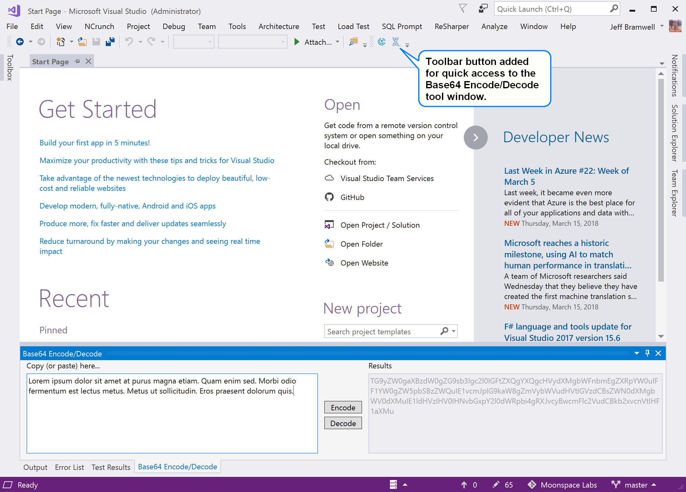
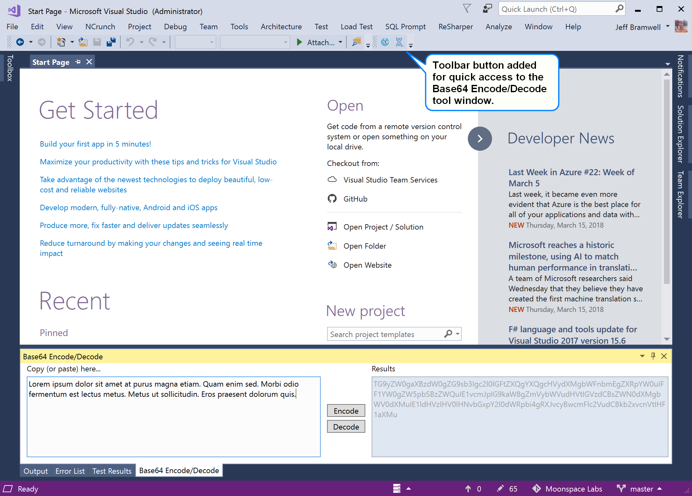
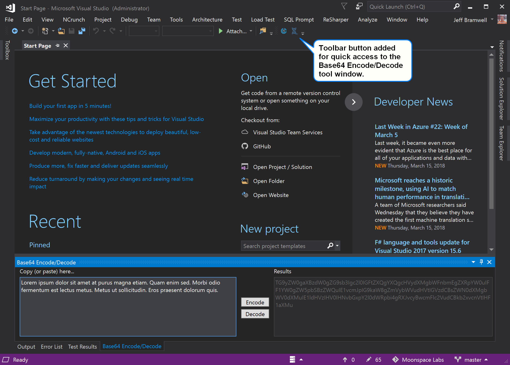

# Base64 Encode/Decode

This is an extension that provides a tool window within Visual Studio that provides you with the ability to Base64 encode (or decode) text. Instead of bouncing out to your favorite web browser to encode/decode your data, you can do it from the comfort of the Visual Studio IDE!

## Installing the Extension

You have a few options for installing this extension.

1. Clone this repository, compile the code and run the resulting VSIX file that is generated.
1. The latest version of this extension can be installed from the Visual Studio Marketplace [here](https://marketplace.visualstudio.com/items?itemName=moonspace-labs-llc.Base64EncodeDecode).
1. Within Visual Studio, click on **Tools** then **Extensions and Updates...**, search for "Base64" and select and install the **Base64 Encode/Decode** extension. 

## Using the Base64 Encode/Decode Tool Window

Once you have installed the extension, click on the **View** menu, **Other Windows** and then **Base64 Encode/Decode**. Once the tool window has been displayed, you can dock the window anywhere you like, just like any other window in Visual Studio.

If desired, you can add a toolbar button to an existing (or new) toolbar for quick access. See the screenshots below for an example of where a toolbar button has been added.

## Screenshots

### Light Theme

### Blue Theme

### Dark Theme

